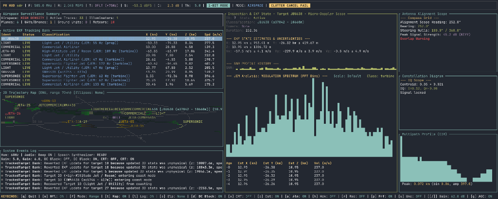

# Passive Radar (Forward-Scatter) DSP Pipeline

A high-performance, real-time software-defined radio (SDR) passive radar system written in Rust. This system exploits existing ambient RF "illuminators of opportunity" (like commercial FM radio towers) to detect and track aircraft via forward-scatter and bistatic reflections. 

It is designed with a DIY "doing more with less" ethos: with just a simple telescoping whip antenna, a metal kitchen baking sheet as a ground plane, and a budget SDR (like a HackRF or RTL-SDR), you can track aircraft flying overhead in real time!



---

## Quick-Start Guides: Three Audiences

*   [Hobbyists & Beginners](#1-hobbyists--beginners-diy-guide) — Conceptual explanation, physical hardware setup, and basic usage.
*   [Developers & Intermediate](#2-developers--intermediate-guide) — Compilation, detailed Rust CLI parameters, and the Web Companion HUD.
*   [RF & Math Experts](#3-rf--math-experts-guide) — High-level mathematical overview of the DSP, Adelic Optimization, and Čech Cohomology algorithms, with links to full derivations.

---

## 1. Hobbyists & Beginners: DIY Guide

Passive radar works like a classic radar system but without a transmitter of its own. Instead, it relies on others' transmitters.

```
                  [Aircraft (Scatterer)]
                       /          \
                      /            \ (Scattered Path)
                     /              \
                    /                v
[FM Radio Tower (Tx)] ------------> [Your Antenna (Rx)]
                      (Direct Path)
```

### Key Concepts
*   **Direct Path Signal**: The signal traveling straight from the FM radio tower to your receiver. The system uses this to know exactly what the tower is transmitting at any moment.
*   **Scattered Path Signal**: The signal that travels from the tower, hits a passing aircraft, and bounces back down to your antenna.
*   **Cross-Ambiguity Function (CAF)**: By comparing the difference in arrival times (bistatic range delay) and the frequency shift (Doppler shift) between the direct path and scattered path, the system detects moving aircraft.

### DIY Hardware Setup
Setting up a passive radar receiver is easy and cost-effective:
1.  **Antenna**: Grab a basic metal telescoping whip antenna.
2.  **Ground Plane**: Place the antenna magnetic base in the middle of a metal kitchen baking sheet (steel or aluminum). The baking sheet acts as a ground plane mirror, converting your quarter-wave whip antenna into a virtual half-wave dipole, greatly improving signal reception.
3.  **Tuning**: Extend the antenna to about **76 cm (30 inches)**, which is the quarter-wavelength for the middle of the FM radio band ($\sim 98 \text{ MHz}$).
4.  **Placement**: Position your setup near a window with a clear view of the sky, away from power lines and computers.
5.  **SDR Connection**: Plug the antenna coaxial cable into your SDR receiver (HackRF One, RTL-SDR, etc.) and connect the SDR to your computer.

For detailed hardware positioning and optimization instructions, see [docs/setup.md](docs/setup.md).

### Quick-Start Execution
If you do not have SDR hardware, the system runs a high-fidelity aircraft flight simulation by default:
1.  Install Rust on your computer (`https://rustup.rs`).
2.  Clone the repository and run:
    ```bash
    cargo run --release
    ```
3.  Observe the Terminal UI dashboard!

---

## 2. Developers & Intermediate Guide

This software is built in Rust for speed, safety, and parallel processing. It features a SIMD-accelerated decimation engine, GPU-accelerated FFTs, and a highly responsive Terminal UI.

### Compiling
Build the optimized release binary:
```bash
cargo build --release
```
To compile without GPU WebGPU support (ideal for headless servers, edge machines, or Raspberry Pi):
```bash
cargo build --release --no-default-features
```

### Running the CLI
Start the system using `cargo run --release -- [FLAGS]`. For example:
```bash
# Run in live hardware mode tuned to 98.1 MHz
cargo run --release -- --mode sdr --freq 98.1

# Run in CPU-only mode with custom gains and custom web listener port
cargo run --release -- --mode sdr --freq 98.1 --disable-gpu --lna 32.0 --vga 24.0 --web-port 9000
```

### CLI Flags Reference
Below is the complete list of command-line arguments supported by `src/main.rs`:

| Flag / Option | Argument Type | Default Value | Description |
| :--- | :--- | :--- | :--- |
| `-m, --mode` | `sim` or `sdr` | `"sim"` | Ingestion mode: `sim` for simulated flights, `sdr` for physical hardware. |
| `-f, --freq` | `f64` (Optional) | `None` | Target FM radio frequency in MHz (auto-tunes to optimal tower if omitted). |
| `-r, --rate` | `f64` | `2.048` | SDR input sample rate in MSPS. |
| `--lna` | `f64` (Optional) | `32.0` | Optional SDR LNA gain in dB. |
| `--vga` | `f64` (Optional) | `30.0` | Optional SDR VGA gain in dB. |
| `--compat` | `bool` | `false` | Enable compatibility mode (ASCII borders, simpler canvas symbols) for terminals without full Unicode support. |
| `--test-script` | `String` (Optional) | `None` | Path to a test script text file for E2E testing. |
| `--test-out` | `String` (Optional) | `None` | Directory path where test frame dumps are written. |
| `--width` | `u16` (Optional) | `None` | Override terminal width for testing. |
| `--height` | `u16` (Optional) | `None` | Override terminal height for testing. |
| `--disable-gpu` | `bool` | `false` | Disable GPU-accelerated FFTs (fallback to CPU). |
| `--heading` | `f64` | `0.0` | Alignment compass heading in degrees (allows negative values). |
| `--no-towers` | `bool` | `false` | Disable tower loading (run without signal transmitters). |
| `--no-signal` | `bool` | `false` | Run with an empty/no-signal constellation. |
| `--tower-at-origin` | `bool` | `false` | Overrides active tower positions to receiver origin (0,0,0). |
| `--many-towers` | `bool` | `false` | Mock 50 dummy active towers for TUI overlap limit testing. |
| `--mock-no-audio` | `bool` | `false` | Mock audio hardware failure. |
| `--max-targets` | `bool` | `false` | Mock 100+ active targets for audio hum clipping testing. |
| `--mock-target-termination` | `bool` | `false` | Force target termination in simulation for testing. |
| `--port` | `u16` (Optional) | `None (falls back to 8085)` | Custom WebSocket listener port for streaming telemetry. |
| `--web-port` | `u16` | `8080` | Custom Web HUD companion HTTP listener port. |
| `--host` | `String` | `"127.0.0.1"` | Custom WebSocket listener host address. |
| `--lat` | `f64` (Optional) | `None` | Override receiver latitude (allows negative values). |
| `--lon` | `f64` (Optional) | `None` | Override receiver longitude (allows negative values). |

### Web HUD Companion
The system hosts a concurrent web server that broadcasts real-time telemetry and waterfall data directly to your web browser:
1. Start the radar stack: `cargo run --release`.
2. Open a browser and navigate to `http://127.0.0.1:8080` (or your custom `--web-port`).
3. The interactive HUD features:
   * **Plan Position Indicator (PPI) Scope**: Real-time aircraft tracks, history trails, and bracketed lock overlays.
   * **Range-Doppler Waterfall**: Scrolling spectrogram visualizing target reflection strengths.
   * **Micro-Doppler JEM (Jet Engine Modulation)**: 3D target altitude tracks and blade-strike micro-Doppler signatures.
   * **Interactive Soundscape**: real-time synthesized audio representing target proximity and speed (Web Audio API).

---

## 3. RF & Math Experts Guide

The Passive Radar codebase utilizes advanced digital signal processing and topological data analysis methods to solve the low SNR bistatic tracking problem.

### Algorithm Summaries

*   **Adelic Langevin Optimization**: Fits aircraft 3D trajectories $[x, y, z, v_x, v_y, v_z]^T$ using stochastic gradient descent in the Adelic Continuous Ring space. It maps coordinate variables into $p$-adic integers using the Monna map and leverages p-adic distance and Vladimirov fractional derivatives to execute "Adelic Jumps" (branch tunneling) that hop over local minima in the cost landscape.
*   **Čech Cohomology Filtering**: Suppresses ghost target intersections. In a dense transmitter network, intersecting range-Doppler bistatic ellipses can generate false target detections. The tracking bank computes a Čech complex cycle obstruction:
    $$
    E = \sum_{j} \min_{k} \left| f_{D,j} - f_{peak,j,k} \right|
    $$
    representing the cumulative Doppler error across towers. Detections exceeding $300.0 \text{ Hz}$ in topological discrepancy are pruned.
*   **Fractional Delay Filtering**: Achieves sub-sample delay resolution using the Fourier Shift Theorem in the frequency domain. By applying a linear phase shift of $e^{j 2\pi f \tau}$ directly to the spectrum, we interpolate signal correlation at fractional sample delay $\tau$.
*   **Filtered Backprojection Tomography**: Performs ISAR and orbital tomographic reconstructions. Slices are filtered in the frequency domain using a Ram-Lak (ramp) filter $H(f) = |f|$ before being backprojected and linearly interpolated onto a spatial grid.
*   **Zero-Allocation Real-time Loop**: Minimizes garbage collection and memory allocator lock contention. Strategies include decimation buffer swapping via `std::mem::take`, main-thread sequential pre-allocation of multithreaded Rayon matrices, and struct-level reuse of scratch vectors in the FFT and wavelet engines.

For detailed mathematical derivations and equations, see [docs/math.md](docs/math.md).

For step-by-step physical optimization, see [docs/setup.md](docs/setup.md).
