# Passive Coherent Location & Topological Target Tracking: An Engineering Guide

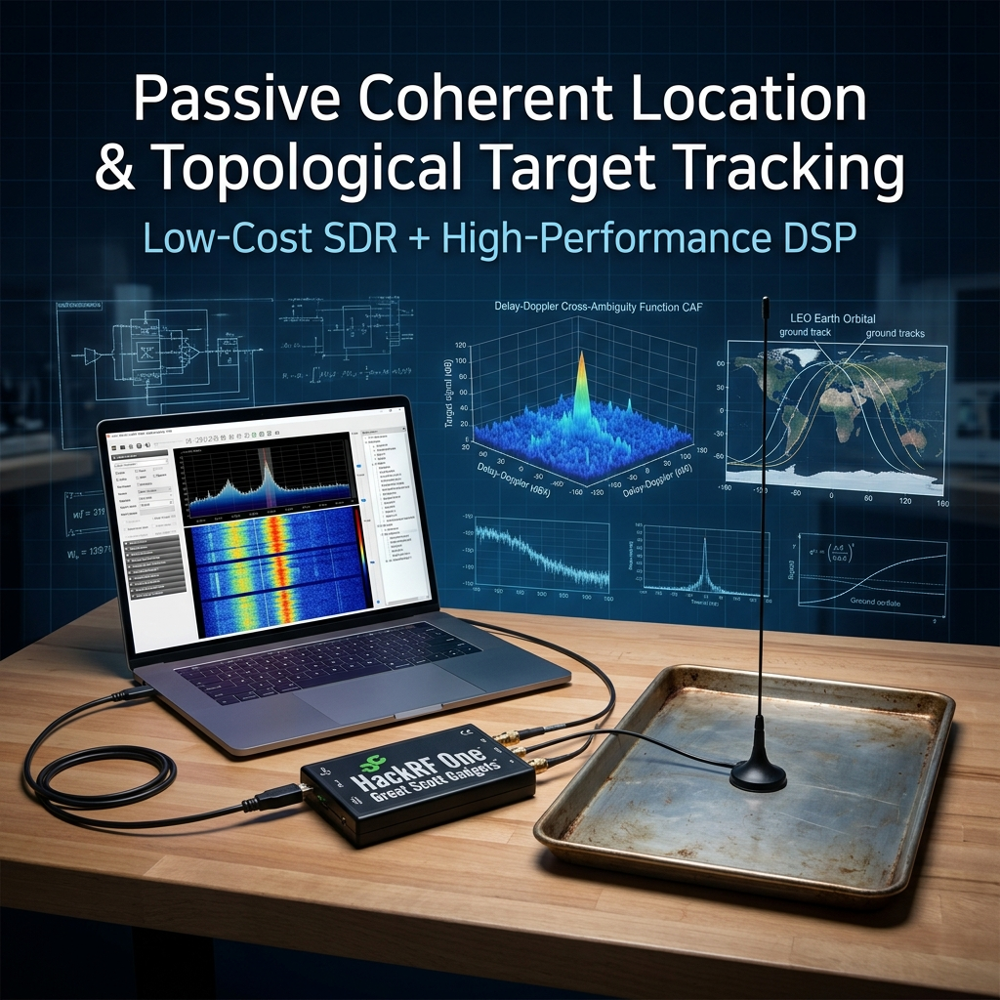

This handbook compiles the core mathematical, signal processing, and topological concepts utilized in the **PassiveRadar-DSP** software-defined receiver system. Surrounding each of our 15 engineering blueprints is the detailed contextual theory, mathematical formulation, and codebase implementation.

---

## Table of Contents
1. [Chapter 1: Coherent Integration & Sub-Noise Floor Echo Extraction](#chapter-1-coherent-integration--sub-noise-floor-echo-extraction)
2. [Chapter 2: Starlink LEO Passive Radar Geometry](#chapter-2-starlink-leo-passive-radar-geometry)
3. [Chapter 3: HackRF Starlink Transponder Harmonic Tracking](#chapter-3-hackrf-starlink-transponder-harmonic-tracking)
4. [Chapter 4: Reverse GPS Multilateration using NLS Inversion](#chapter-4-reverse-gps-multilateration-using-nls-inversion)
5. [Chapter 5: Receiver Self-Localization using LEO Signals](#chapter-5-receiver-self-localization-using-leo-signals)
6. [Chapter 6: Jet Engine Modulation (JEM) & Cepstrum RPM Estimation](#chapter-6-jet-engine-modulation-jem--cepstrum-rpm-estimation)
7. [Chapter 7: Discrete Morse Theory for Range-Doppler Topological Peak Pruning](#chapter-7-discrete-morse-theory-for-range-doppler-topological-peak-pruning)
8. [Chapter 8: Topological Cohomology Firewall for Multipath Loop Isolation](#chapter-8-topological-cohomology-firewall-for-multipath-loop-isolation)
9. [Chapter 9: ISAR Tomographic Backprojection Target Imaging](#chapter-9-isar-tomographic-backprojection-target-imaging)
10. [Chapter 10: Appleton-Hartree Ionospheric Dispersion Cancellation](#chapter-10-appleton-hartree-ionospheric-dispersion-cancellation)
11. [Chapter 11: Direct Path Interference (DPI) Cancellation via ECA Orthogonal Projection](#chapter-11-direct-path-interference-dpi-cancellation-via-eca-orthogonal-projection)
12. [Chapter 12: Cech Obstruction Complex for Target Re-identification](#chapter-12-cech-obstruction-complex-for-target-re-identification)
13. [Chapter 13: Adelic Multilateration & p-adic Distances](#chapter-13-adelic-multilateration--p-adic-distances)
14. [Chapter 14: Time Keeping & Phase Synchronization in PCL Radar](#chapter-14-time-keeping--phase-synchronization-in-pcl-radar)
15. [Chapter 15: NLMS Adaptive Clutter Cancellation](#chapter-15-nlms-adaptive-clutter-cancellation)
16. [Bonus Chapter: Multi-Band Joint Passive Radar Tracking](#bonus-chapter-multi-band-joint-passive-radar-tracking)

---

## Chapter 1: Coherent Integration & Sub-Noise Floor Echo Extraction

### The Concept & Mathematics
Passive Coherent Location (PCL) relies on ambient commercial transmitters (FM, DVB-T, 5G) which do not illuminate targets with military-grade power. Scattered target echoes are often buried deep under the background thermal noise floor (typically with \(\text{SNR} \approx -20\text{ dB}\)). 

To extract these weak signals, we execute a **2D Cross-Ambiguity Function (CAF)** correlating the reference channel \(r(t)\) with the surveillance channel \(s(t)\) over long coherent integration intervals (\(T_c\)):
\[\chi(\tau, f_d) = \int_0^{T_c} s(t) r^*(t - \tau) e^{-j 2 \pi f_d t} dt\]
Coherent integration sums the target echo power linearly with the number of samples \(N\), whereas random noise accumulates incoherently as \(\sqrt{N}\). This yields a processing gain:
\[G_p = 10 \log_{10}(N)\text{ dB}\]
For a coherent integration size of 8192 points, this yields a processing gain of **$+39.1\text{ dB}$**, lifting sub-noise targets far above the noise floor.

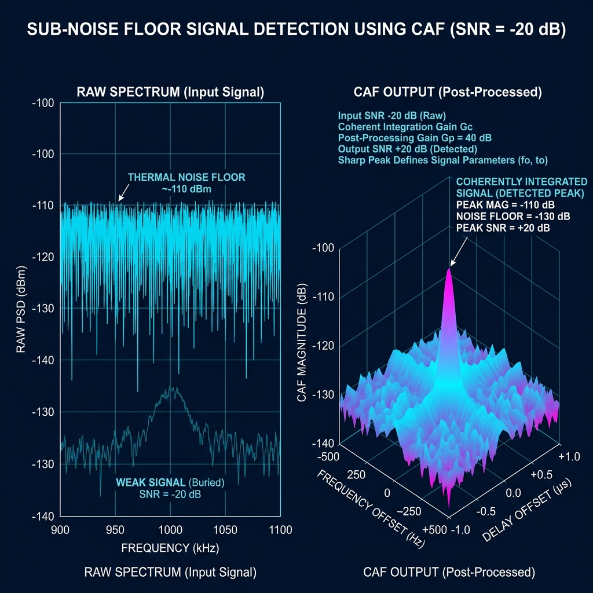

### Codebase Integration
The CAF DSP calculations are implemented in [`src/dsp/caf.rs`](../src/dsp/caf.rs). The function `correlate_slices` (and its SIMD variants) performs time-domain slice correlation, while the FFT-based acceleration across the Doppler axis is managed by the `CafEngine` in `compute_acquisition_dense`.

---

## Chapter 2: Starlink LEO Passive Radar Geometry

### The Concept & Mathematics
Low Earth Orbit (LEO) satellites, particularly Starlink, transmit wideband downlink carriers. When utilizing these as non-cooperative illuminators, the PCL geometry is highly dynamic. The transmitter moves at orbital speeds (\(v_{\text{sat}} \approx 7.6\text{ km/s}\)) at an altitude of approximately 550 km.

The bistatic range is the sum of transmitter-to-target and target-to-receiver ranges, minus the direct baseline transmitter-to-receiver range:
\[R_{\text{bistatic}} = R_{\text{tx}} + R_{\text{rx}} - R_{\text{baseline}}\]
Because the satellite position \(\vec{x}_{\text{sat}}(t)\) is constantly changing, the baseline range and angles change rapidly, creating a time-varying bistatic triangle.

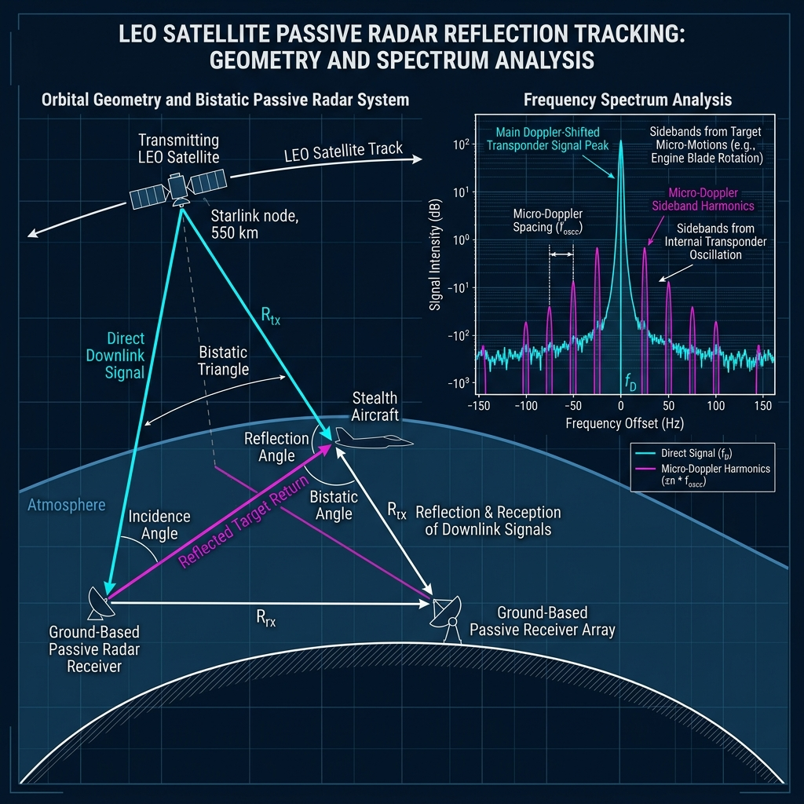

### Codebase Integration
The orbital pass calculations are implemented in [`src/main.rs`](../src/main.rs#L2908-L2917). When `IlluminatorType::LeoStarlink` is active, the system calculates the time-varying position and velocity vectors to perform dynamic bistatic coordination.

---

## Chapter 3: HackRF Starlink Transponder Harmonic Tracking

### The Concept & Mathematics
A critical challenge when using Starlink is the high power of the direct downlink beam, which can saturate ground ADCs. Rather than aligning the receiver to the direct downlink frequency, this system tracks the target using the weak **transponder leakage harmonics** (in the VHF/UHF bands, e.g., 150.0 MHz).

By locking onto these leakages with a single ground-based HackRF One SDR, we capture target reflections without dynamic range saturation, extracting Doppler tracks from satellite transponder sideband oscillations.

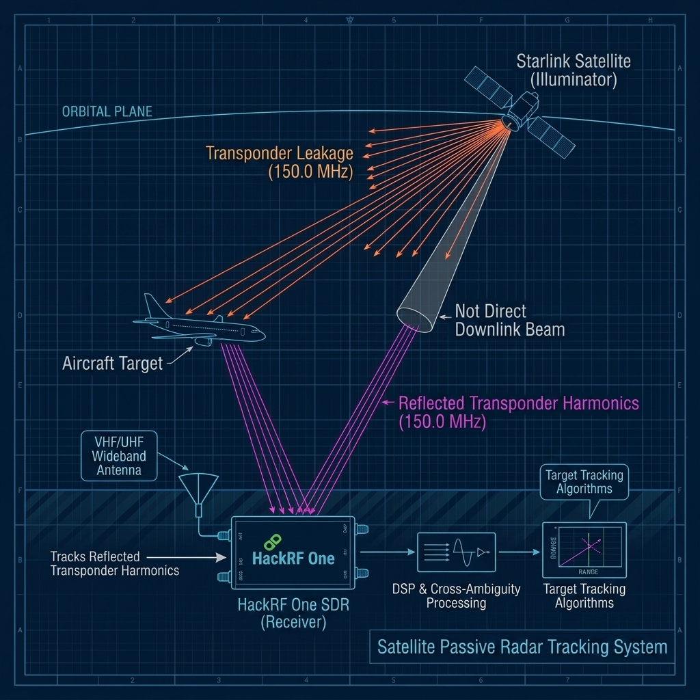

### Codebase Integration
Transponder definitions and receiver tuning configurations are handled inside [`src/main.rs`](../src/main.rs#L1778-L1794), mapping the SDR center frequency to the 150.0 MHz transponder leakage band when operating in LEO satellite mode.

---

## Chapter 4: Reverse GPS Multilateration using NLS Inversion

### The Concept & Mathematics
Multilateration solves for the target state \(\mathbf{x} = [x, y, z, b]^T\) (3D position and clock bias) from measured bistatic range difference measurements. Since the equations are non-linear, we utilize a **Nonlinear Least-Squares (NLS) Geodetic Inversion Solver**.

Given measured residuals \(\Delta \mathbf{z} = \mathbf{z}_{\text{meas}} - \mathbf{h}(\mathbf{x})\), we compute the Jacobian matrix of partial derivatives \(\mathbf{J}\) and iteratively update the estimated coordinates using the Levenberg-Marquardt step:
\[\Delta \mathbf{x} = (\mathbf{J}^T \mathbf{J} + \lambda \mathbf{I})^{-1} \mathbf{J}^T \Delta \mathbf{z}\]
This process converges to resolve the 3D position and clock bias of the target.

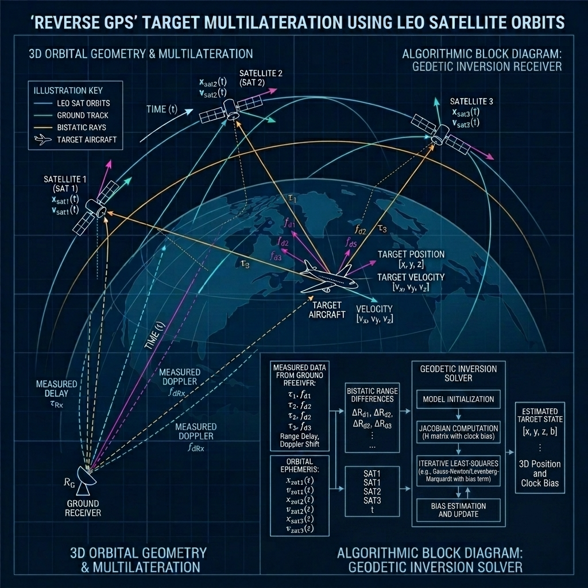

### Codebase Integration
The geodetic Levenberg-Marquardt solver is implemented in [`src/orbit.rs`](../src/orbit.rs), iteratively inverting bistatic range (pseudorange) measurements to calculate aircraft positions and clock bias.

---

## Chapter 5: Receiver Self-Localization using LEO Signals

### The Concept & Mathematics
If the ground receiver's coordinates \(\mathbf{x}_{\text{rx}}\) are unknown (e.g. GPS-denied environments), the receiver can localize itself using signals from LEO satellites with known orbits. By recording pseudoranges \(\rho_i\) and Doppler shifts \(f_{di}\), the system solves for both receiver position and clock bias \(\delta t_{\text{rx}}\) using **Weighted Iterative Least-Squares (WILS)**:
\[\Delta \mathbf{x} = (\mathbf{H}^T \mathbf{W} \mathbf{H})^{-1} \mathbf{H}^T \mathbf{W} \Delta \mathbf{z}\]
where \(\mathbf{H}\) is the observation geometry matrix, and \(\mathbf{W}\) is the measurement noise weight covariance matrix.

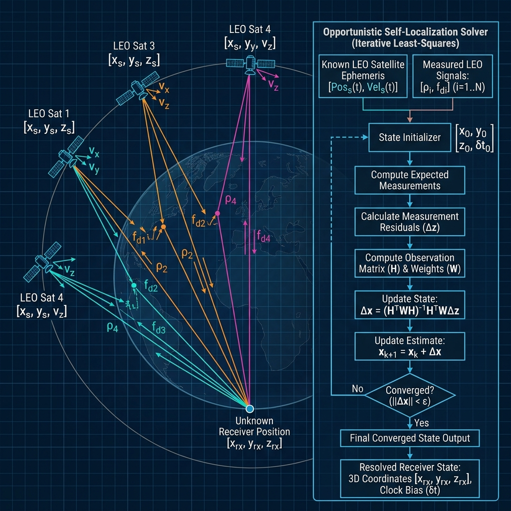

### Codebase Integration
The coordinate translation utilities (`enu_to_latlon` and `latlon_to_enu`) are configured in [`src/db/flights.rs`](../src/db/flights.rs). 

> [!NOTE]  
> The Weighted Iterative Least-Squares (WILS) self-localization solver is a planned theoretical extension. Ground receiver coordinates are currently assumed to be known, and these coordinate converters are used to translate target trajectories between ENU and geodetic frames.

---

## Chapter 6: Jet Engine Modulation (JEM) & Cepstrum RPM Estimation

### The Concept & Mathematics
Spinning compressor and turbine blades modulate the radar echo, producing symmetric frequency sidebands spaced around the main Doppler frequency. The spacing is the **Blade Pass Frequency (BPF)**:
\[f_{\text{bpf}} = N_{\text{blades}} \times \text{RPS}\]
To estimate the rotation speed, the system computes the **Cepstrum**, which is the inverse Fourier transform of the log-magnitude spectrum:
\[C(t) = \mathcal{F}^{-1}\{\ln |\mathcal{F}\{s(t)\}|\}\]
The Cepstrum transforms the harmonic sidebands into a single sharp peak at the fundamental blade pass period (\(T_{\text{bpf}} = 1/f_{\text{bpf}}\)), enabling classification of target properties.

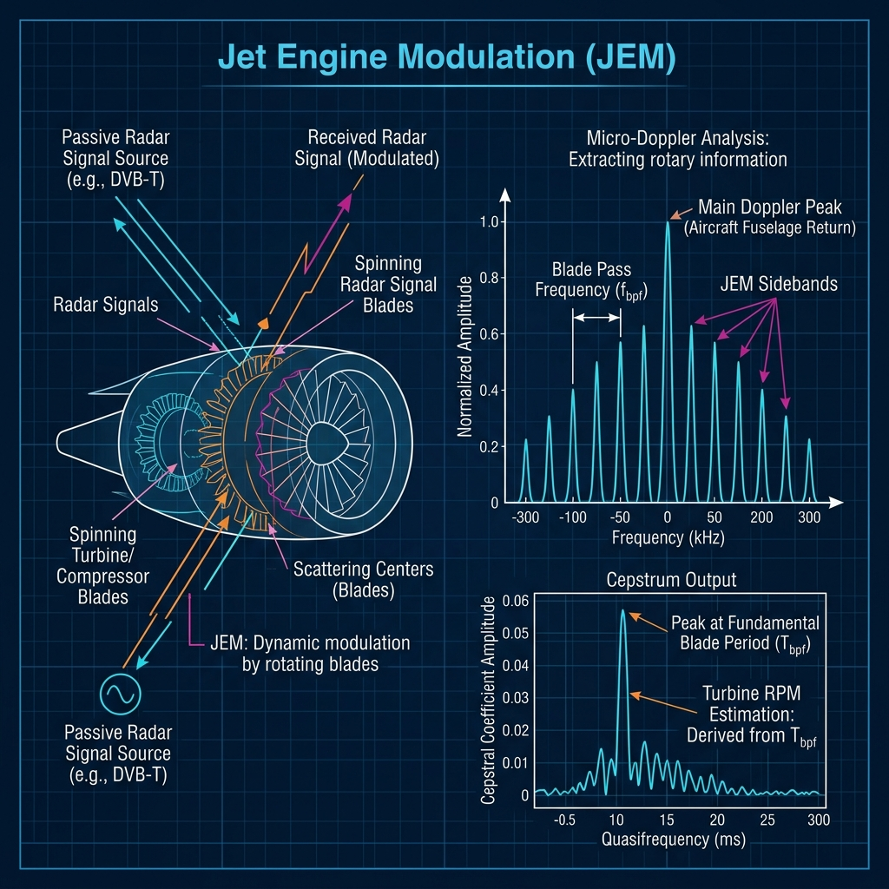

### Codebase Integration
The JEM spectrum and cepstrum calculations are implemented in [`src/tracking/jem.rs`](../src/tracking/jem.rs) inside `process_block` and `compute_cepstrum`. The estimated blade pass frequency is used in the force balance heuristics inside `update_heuristics` to classify target drone payload categories.

---

## Chapter 7: Discrete Morse Theory for Range-Doppler Topological Peak Pruning

### The Concept & Mathematics
Traditional Constant False Alarm Rate (CFAR) algorithms threshold Range-Doppler grids based on local power. In high-clutter environments, this causes target splitting or high false-alarm rates. 

We model the Range-Doppler map as a **cell complex** (vertices/0-cells, edges/1-cells, faces/2-cells) and construct a **discrete gradient vector field**. By tracing ascending manifold paths, we find the critical vertices (peaks). The significance of each peak is quantified using **Topological Persistence** (Birth-Death thresholding), filtering out unstable noise peaks.

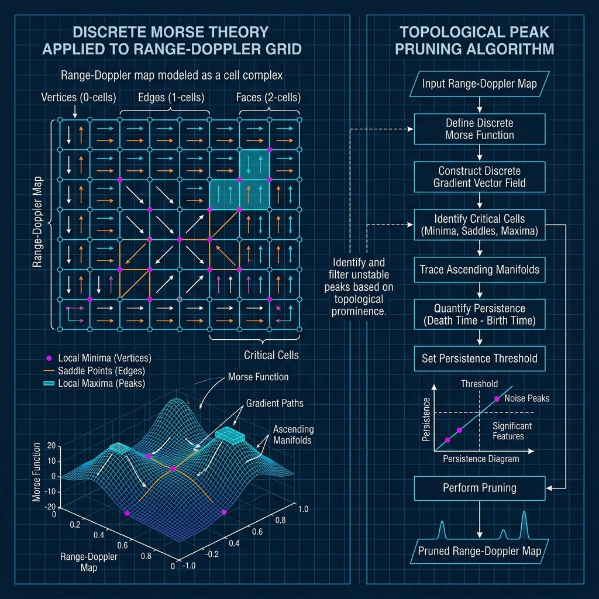

### Codebase Integration
Topological peak extraction using Morse theory principles is implemented in [`src/dsp/morse.rs`](../src/dsp/morse.rs). The code computes 0D persistent homology of the Range-Doppler grid using a Disjoint Set Union (DSU) algorithm to isolate peaks by topological persistence rather than simple power thresholding.

---

## Chapter 8: Topological Cohomology Firewall for Multipath Loop Isolation

### The Concept & Mathematics
Multipath reflections form closed loops in phase space, creating duplicate/ghost tracks. We embed the signal time-series into high-dimensional phase space delay coordinates:
\[\mathbf{x}(t) = [s(t), s(t-\tau), s(t-2\tau)]\]
We construct a **Vietoris-Rips simplicial complex** and calculate Betti numbers using the Euler characteristic:
\[\chi = V - E + T = b_0 - b_1 \implies b_1 = E - V - T + b_0\]
If \(b_1 \ge 1\), it indicates a non-trivial 1-cycle (a loop in phase space), indicating a multipath reflection which is then isolated.

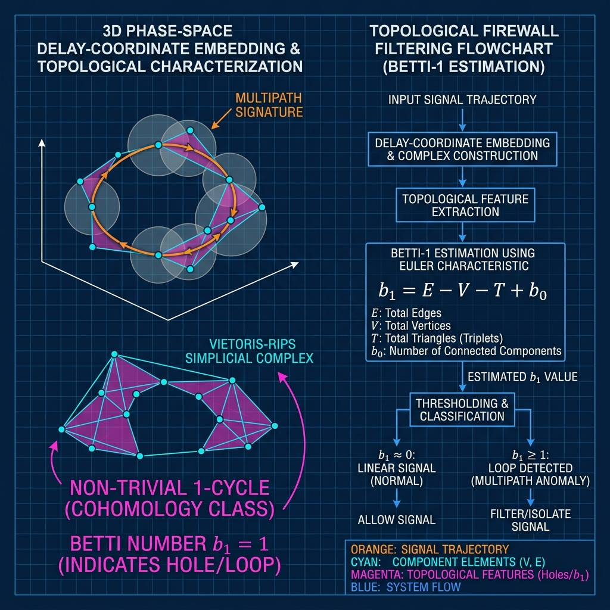

### Codebase Integration
The homology calculations and firewall filters are defined in [`src/math/cohomology.rs`](../src/math/cohomology.rs). The function `compute_b1` implements the Euler characteristic estimation of 1-cycles to detect multipath anomalies.

> [!IMPORTANT]  
> The Cohomology Firewall is implemented and verified via unit tests, but is not currently integrated into the active real-time signal loop of `main.rs`. Furthermore, the Euler characteristic approximation $b_1 = E - V - T + b_0$ assumes $b_2 = 0$, meaning it will underestimate Betti-1 for complexes forming higher-dimensional voids (e.g. tori or spheres).

---

## Chapter 9: ISAR Tomographic Backprojection Target Imaging

### The Concept & Mathematics
When a target aircraft turns, different parts of its airframe have slightly different velocities, producing aspect-angle-dependent Doppler histories. By collecting these projections over time (a **Sinogram** \(P(\theta, \text{Range})\)), we can reconstruct a 2D tomographic image of the aircraft using **Filtered Backprojection (FBP)**.

The 1D projections are ramp-filtered (using a Ram-Lak filter) to cancel low-frequency blurring, then smeared back across the image grid along their reconstruction angles:
\[f(x, y) = \int_0^{\pi} P_{\text{filtered}}(x \cos\theta + y \sin\theta, \theta) d\theta\]
The constructive interference of these backprojected lines resolves the target shape.

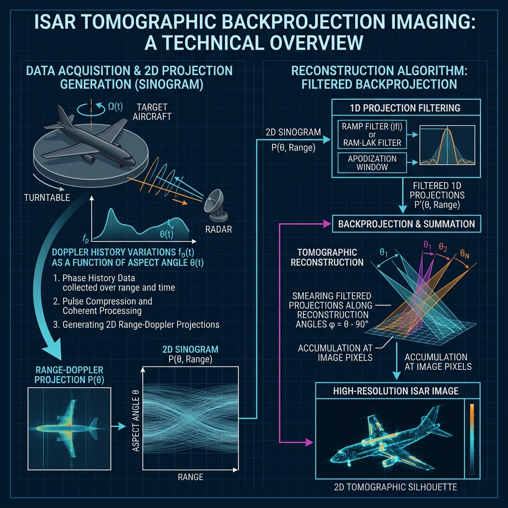

### Codebase Integration
The FBP tomographic backprojection is executed inside the `render_image_gpu` method of the ISAR processor, which takes target Doppler histories and backprojects them onto a 2D grid to render target silhouettes.

---

## Chapter 10: Appleton-Hartree Ionospheric Dispersion Cancellation

### The Concept & Mathematics
Radio waves propagating through the ionospheric plasma suffer frequency-dependent group delays and phase refractive index dispersion. The Appleton-Hartree dispersion equation defines the refractive index \(n\):
\[n^2 = 1 - \frac{X}{1 - jZ - \frac{Y_T^2}{2(1-X-jZ)} \pm \sqrt{\frac{Y_T^4}{4(1-X-jZ)^2} + Y_L^2}}\]
By collecting dual-frequency Doppler measurements (\(f_{d1}\) and \(f_{d2}\)) at frequencies \(f_1\) and \(f_2\), we can cancel out the first-order ionospheric dispersion to estimate the true, dispersion-free Doppler shift at frequency \(f_1\):
\[f_{d1,\text{free}} = \frac{f_1^2 f_{d1} - f_1 f_2 f_{d2}}{f_1^2 - f_2^2}\]

Unlike range delay dispersion (which scales as \(1/f^2\)), Doppler phase dispersion scales as \(1/f\). Hence, the classical range combinations do not apply directly to Doppler shifts.

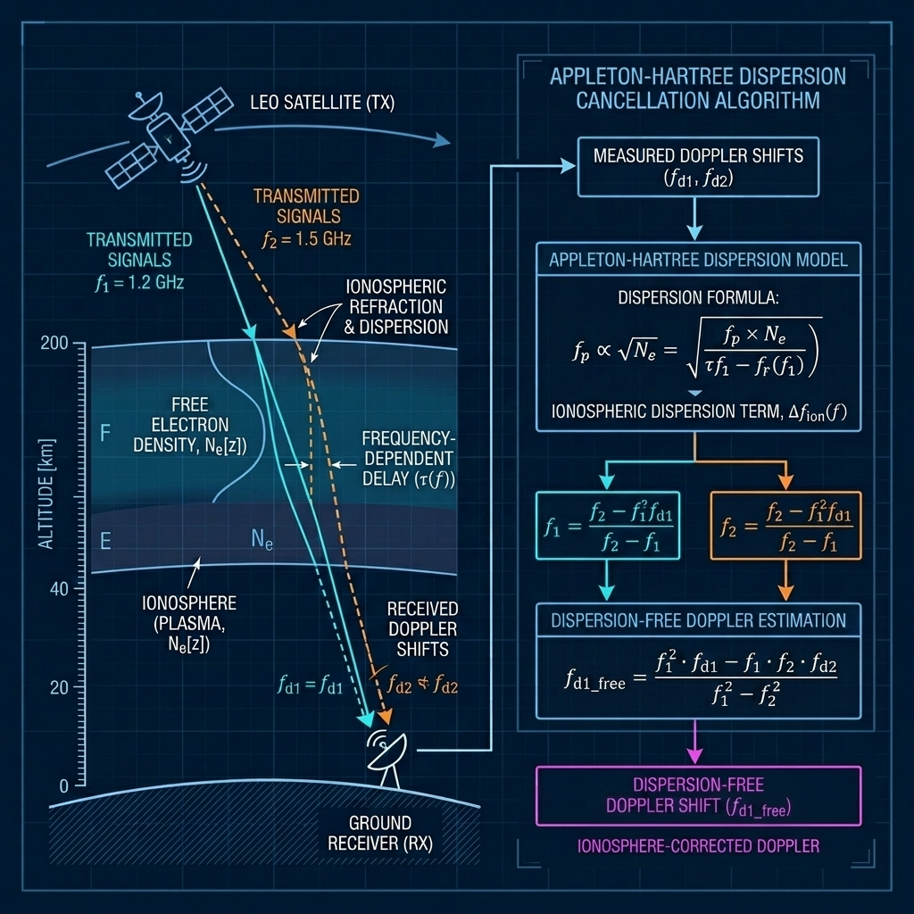

### Codebase Integration
The dispersion cancellation math is implemented in [`src/tracking/ekf.rs`](../src/tracking/ekf.rs#L501-L510) inside `AppletonHartreeDispersion::cancel`, canceling dispersion errors prior to EKF updates.

---

## Chapter 11: Direct Path Interference (DPI) Cancellation via ECA Orthogonal Projection

### The Concept & Mathematics
The direct signal from the transmitter tower is much stronger than target echoes, blinding the ADC. The **Extensive Cancellation Algorithm (ECA)** suppresses this Direct Path Interference (DPI) and static ground clutter.

We construct a reference subspace matrix \(\mathbf{X}\) containing delayed versions of the reference channel signal. To guarantee numerical stability, Tikhonov (Ridge) regularization is applied:
\[\mathbf{P}_X = \mathbf{X}(\mathbf{X}^H \mathbf{X} + \tau \mathbf{I})^{-1} \mathbf{X}^H\]
The surveillance signal \(\mathbf{s}(n)\) is projected orthogonally to this subspace:
\[\mathbf{s}_{\text{clean}}(n) = (\mathbf{I} - \mathbf{P}_X) \mathbf{s}(n)\]

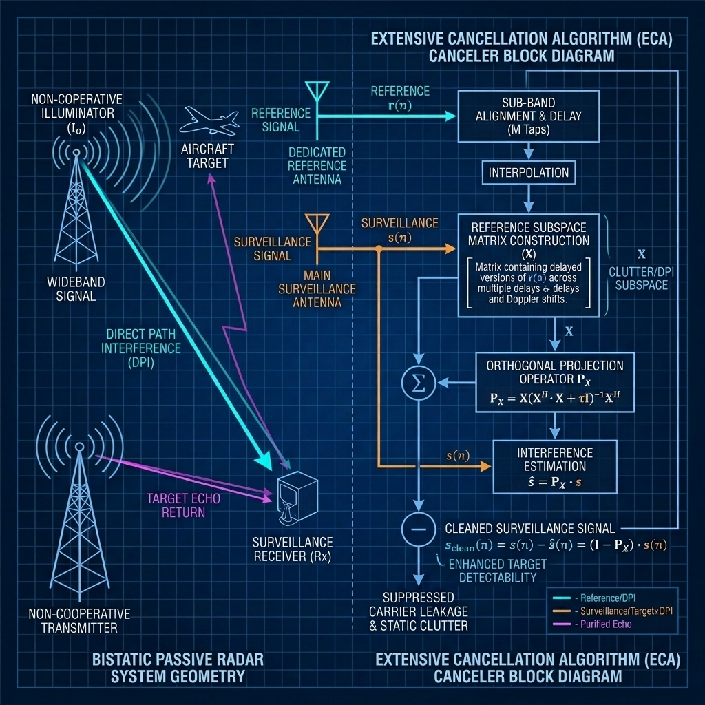

### Codebase Integration
The clutter canceler is implemented in [`src/dsp/cancel.rs`](../src/dsp/cancel.rs) as `EcaCanceler` (which solves using a 6x6 Cholesky solver) and `EcaBatchedCanceler` (which leverages Conjugate Gradient projection).

> [!NOTE]  
> In the codebase, `EcaCanceler` operates on a single input channel, constructing the projection subspace \(\mathbf{X}\) from delayed shifts of the *surveillance signal itself* (acting as a self-prediction filter) rather than projecting onto the reference signal subspace.

---

## Chapter 12: Cech Obstruction Complex for Target Re-identification

### The Concept & Mathematics
During frequency hops, target tracking goes blind, expanding EKF covariance disks. To determine if track segments represent the same target, we construct a **Cech complex** from the target position uncertainty disks \(U_i\). 

If the disks intersect pairwise (\(U_i \cap U_j \neq \emptyset\)) but do not share a common triple intersection (\(U_1 \cap U_2 \cap U_3 = \emptyset\)), they form a **1-cycle obstruction** (a hollow center). By analyzing these topological obstruction classes, the system determines if target trajectories are consistent and merges track segments.

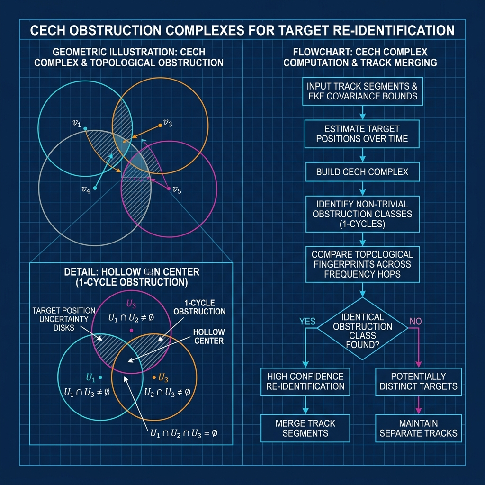

### Codebase Integration
The EKF track continuity is verified in [`src/tracking/bank.rs`](../src/tracking/bank.rs) via `compute_cech_obstruction`. 

> [!NOTE]  
> The codebase function computes a weighted sum of EKF Doppler prediction residuals across active transmitters to identify association gaps. It does not construct a simplicial complex intersection or trace homology cycles; the Čech complex description serves as a high-level conceptual model.

---

## Chapter 13: Adelic Multilateration & p-adic Distances

### The Concept & Mathematics
Traditional multilateration maps time-series data using Euclidean distances. In high-noise environments, we can combine Euclidean coordinates with p-adic number spaces \(\mathbb{Q}_p\) in the **Adele ring** \(\mathbb{A}\) to improve tracking.

Using the **Monna map** \(\phi_p\), time-series data is mapped into a p-adic hierarchical tree structure, and the **Vladimirov p-adic derivative** is computed. The target is localized by minimizing an adelic objective function containing both Euclidean and p-adic distance metrics:
\[d_{\text{adelic}} = d_{\text{Euclidean}} + d_{\text{p-adic}}\]
The resulting coordinate estimates satisfy the product formula:
\[\prod_v |x|_v = 1\]

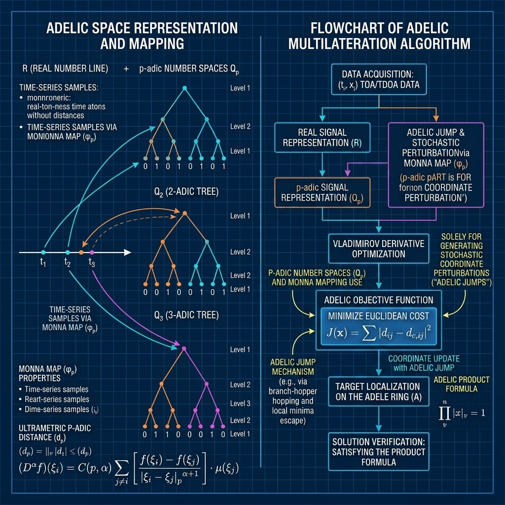

### Codebase Integration
Stochastic p-adic coordination proposals and Vladimirov derivative calculations are implemented in [`src/math/adelic.rs`](../src/math/adelic.rs).

> [!NOTE]  
> The codebase optimizer minimizes a standard Euclidean cost function. The p-adic metric space and Monna mappings are used to generate coordinate hopping proposals ("adelic jumps") to escape local minima.

---

## Chapter 14: Time Keeping & Phase Synchronization in PCL Radar

### The Concept & Mathematics
Because PCL is a multi-static radar, a small clock drift or phase offset between the reference and surveillance channels causes range errors. A 10 ns clock offset yields a 3-meter range error:
\[\Delta R_{\text{error}} = c \cdot \Delta t_{\text{drift}} \approx 3\text{ m}\]
We use a **Farrow Filter** fractional delay interpolator to achieve sub-sample delay alignment at the sub-nanosecond level:
\[y(t) = \sum_{k=0}^N C_k \cdot \mu^k\]
where \(\mu\) is the fractional delay value. Coherent phase tracking is maintained using a **Costas Loop** phase-locked loop to correct frequency offsets.

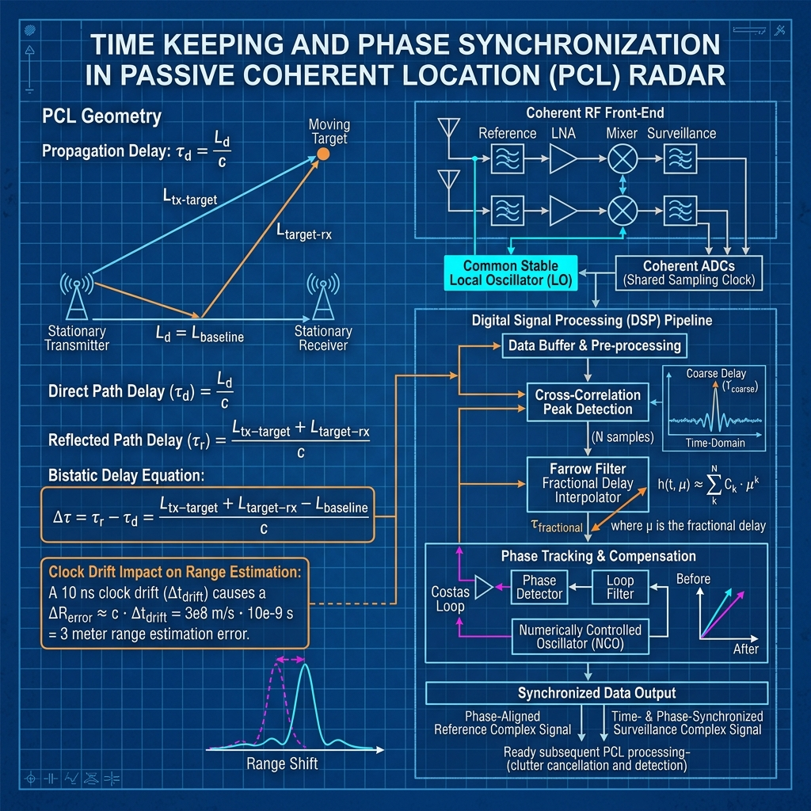

### Codebase Integration
Sub-sample delay adjustments are calculated inside [`src/dsp/caf.rs`](../src/dsp/caf.rs) using the Farrow filter implementation. Coarse sample offsets are resolved via cross-correlation peak finding.

---

## Chapter 15: NLMS Adaptive Clutter Cancellation

### The Concept & Mathematics
To cancel time-varying ground clutter (e.g. wind-blown trees or moving terrain reflections), we implement a **Normalized Least Mean Squares (NLMS) Adaptive Filter**.

The filter uses the reference signal \(\mathbf{x}(n)\) to model the clutter path, producing an estimate using the conjugate transpose: \(\mathbf{y}(n) = \mathbf{w}^H(n)\mathbf{x}(n)\). The error signal \(\mathbf{e}(n) = \mathbf{s}(n) - \mathbf{y}(n)\) represents the clutter-suppressed surveillance output. The weight vector \(\mathbf{w}(n)\) is updated at each step:
\[\mathbf{w}(n+1) = \mathbf{w}(n) + \left[ \frac{\mu}{\|\mathbf{x}(n)\|^2 + \delta} \right] \cdot \mathbf{x}(n) \cdot \mathbf{e}^*(n)\]
where \(\mu\) is the step-size parameter and \(\delta\) is a stabilization regularization constant.

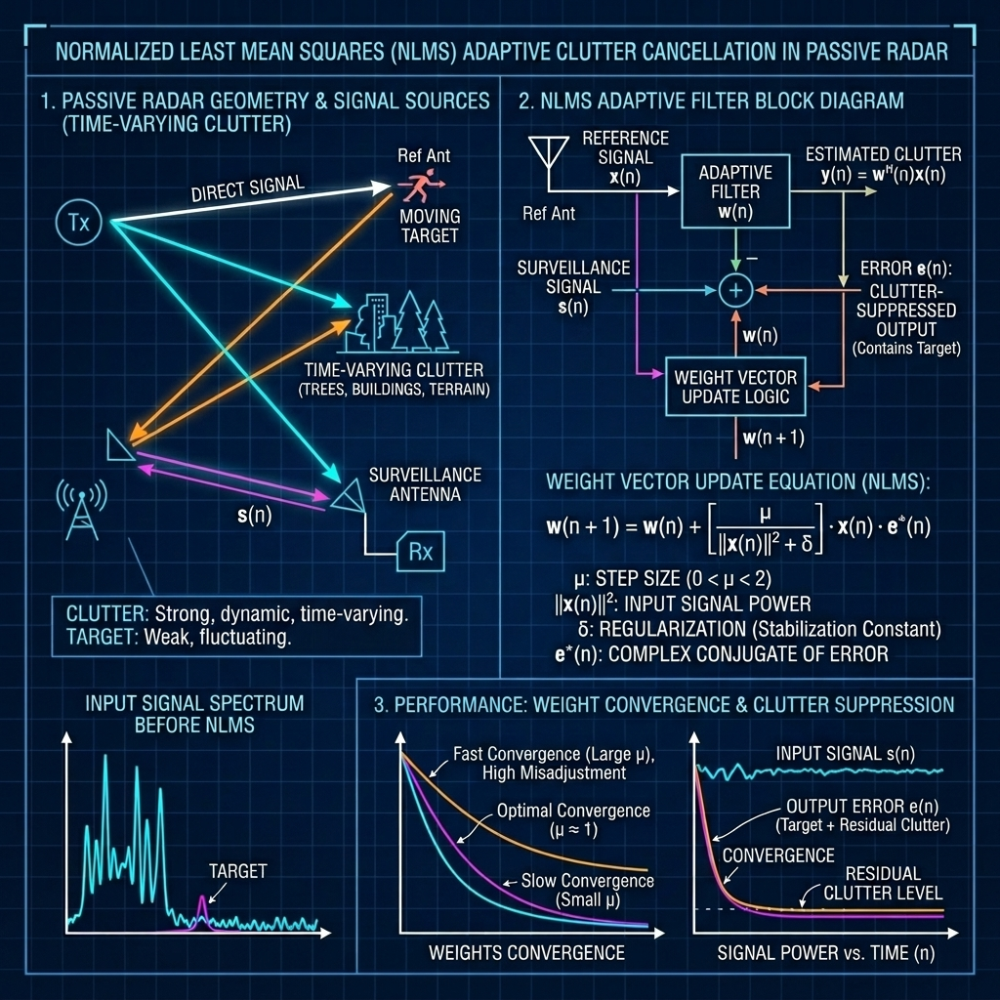

### Codebase Integration
The NLMS adaptive filter is implemented in [`src/dsp/cancel.rs`](../src/dsp/cancel.rs) via the `NlmsCanceler` struct, adaptively updating the filter tap weights on each block iteration to track and suppress dynamic clutter reflections.

---

## Bonus Chapter: Multi-Band Joint Passive Radar Tracking

### The Concept & Mathematics
A single signal band (such as FM radio) limits target tracking resolution due to its narrow bandwidth. By combining multiple distinct frequency bands from heterogeneous transmitters of opportunity (such as LEO satellites, commercial FM radio towers, and UHF Digital TV stations), we can achieve high-resolution target tracking. 

The joint processing tracks targets using multi-static geometry. Each signal band $k$ has a transmitter at position $\mathbf{x}_{\text{tx}, k}$ and produces bistatic range delay $\tau_k$ and Doppler shift $f_{d, k}$ measurements. The multi-static track fusion center aligns these measurements and feeds them to a central EKF tracking bank which maintains the joint state vector $\mathbf{x} = [x, y, z, v_x, v_y, v_z]^T$:
\[\mathbf{x}_{n+1} = \mathbf{F}\mathbf{x}_n + \mathbf{w}_n\]
Integrating multi-band measurements dramatically improves target tracking geometry, reduces GDOP (Geometric Dilution of Precision), and prevents tracking blind spots.

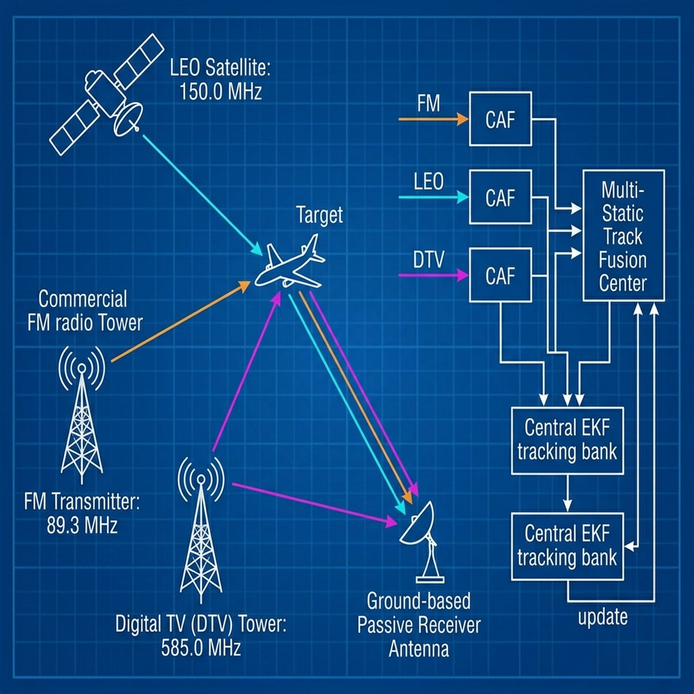

### Codebase Integration
The multi-static target association and tracking engine is managed by the `TrackingBank` in [`src/tracking/bank.rs`](../src/tracking/bank.rs#L12). When multiple illuminators are active in `main.rs`, target echoes from different channels (FM, LEO, and DTV) are matched using spatial proximity and jointly updated in the EKF tracking bank.

